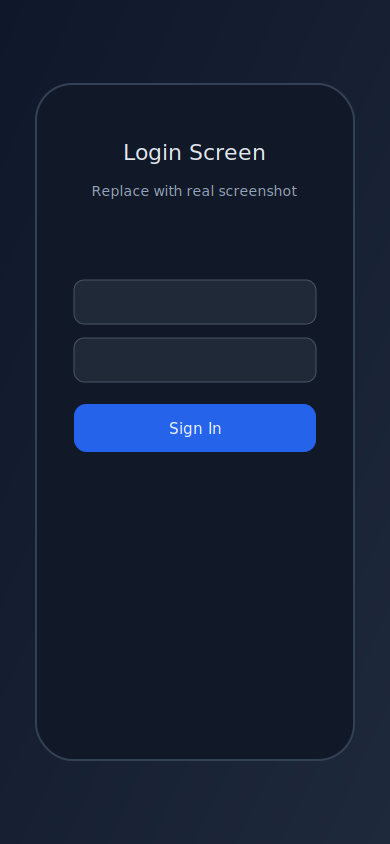
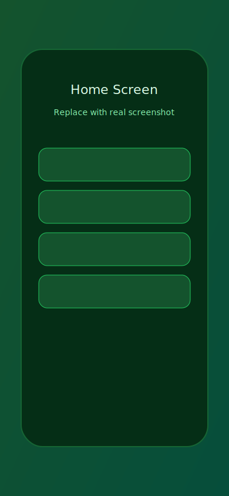
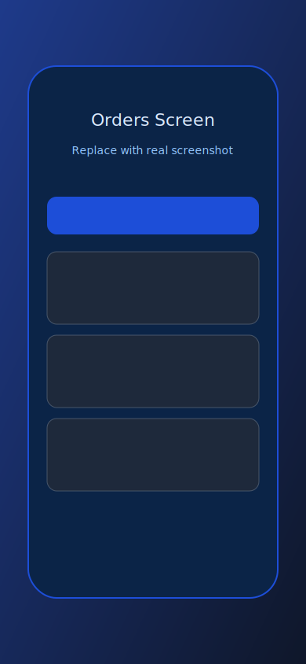
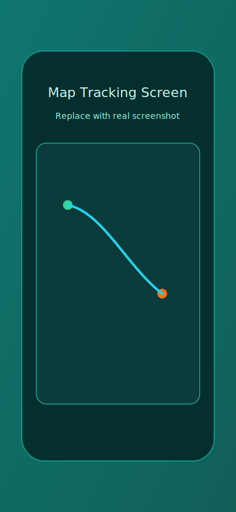
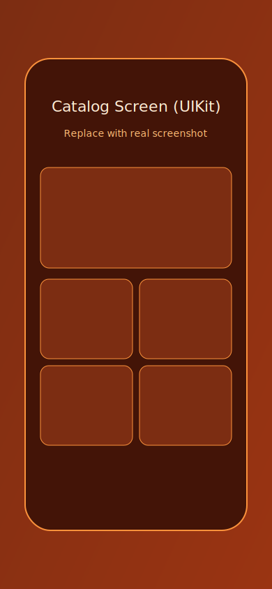
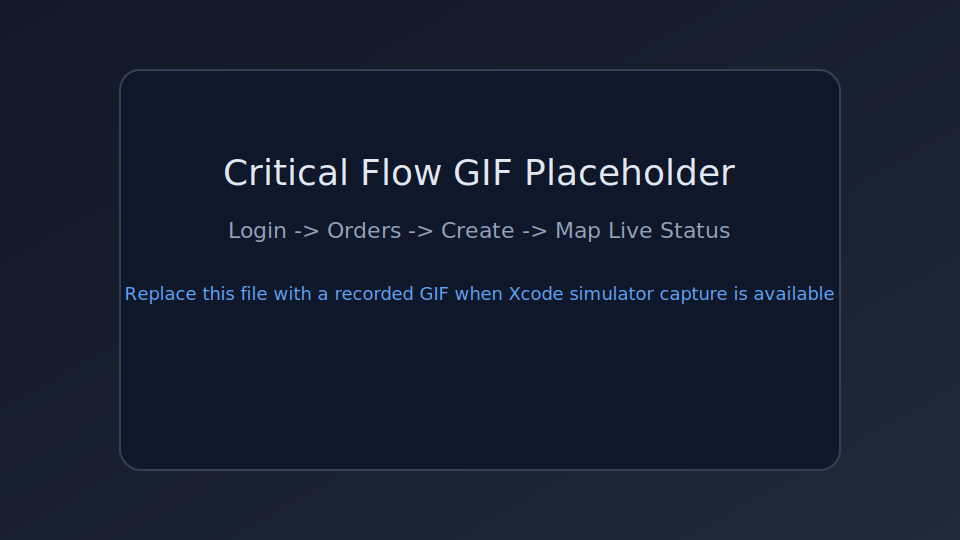
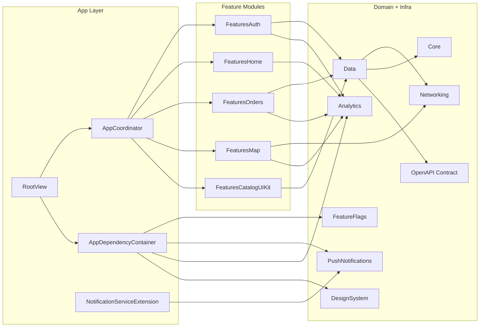

# SwiftRide & Food (iOS)

A production-style iOS architecture demo that combines two real product domains in one app:

- food ordering and history
- ride-style live tracking and status updates

This repository is built to demonstrate senior-level engineering decisions, not just UI output.

> CI badge is intentionally deferred until final public repository URL is confirmed.

## Why This App Exists

Most demo apps only show happy-path screens. Real products fail under:

- unstable network
- stale local state
- permission edge cases
- push payload variation
- runtime configuration drift

This app is designed around those constraints from the initial architecture.

## Product Scope

User can:

1. Sign in with validation, secure token storage, and biometric unlock
2. Navigate by coordinator-driven Home actions
3. Create and view order history with local-first persistence
4. Track live order status and driver location on map
5. Open a complex UIKit catalog screen (compositional + diffable)
6. Receive and mutate push content via Notification Service Extension
7. Run with Firebase integrations when configured, with deterministic safe fallback when not

## Visual Preview

<p align="center">
  
  
  
</p>

<p align="center">
  
  
</p>

<p align="center">
  
</p>

Media assets are intentionally versioned and can be replaced with real captures using the same names.
See `docs/media/README.md`.

## Architecture (High-Level)



## Modules

- `App`: entry point, coordinator, DI container, global error center, push app delegate glue
- `Packages/Core`: shared app errors, retry policy, loadable state, global error contracts
- `Packages/Networking`: endpoint/request builder, HTTP client, retry/interceptors, fixtures, websocket primitives
- `Packages/Data`: DTOs, repositories, Core Data stack, local-first merge strategy
- `Packages/DesignSystem`: reusable typography/colors/components/state feedback view
- `Packages/Analytics`: analytics + crash abstractions and Firebase/no-op implementations
- `Packages/FeatureFlags`: remote config abstraction and Firebase/fallback providers
- `Packages/PushNotifications`: APNs/FCM abstraction, payload parsing, presentation builder, mutator seam
- `Packages/FeaturesAuth`: auth UI/VM, keychain, biometrics, deep-link parser
- `Packages/FeaturesHome`: home destinations + search/filter behavior
- `Packages/FeaturesMap`: map tracking + permission handling + live updates
- `Packages/FeaturesOrders`: order history and order creation
- `Packages/FeaturesCatalogUIKit`: advanced UIKit screen with compositional layout + diffable + image cache

## Engineering Challenges and How They Were Solved

| Challenge | Risk | Solution Implemented | Outcome |
| --- | --- | --- | --- |
| Firebase dependencies available but runtime may be unconfigured | Crash or silent bad behavior at startup | Centralized runtime provider selection via `AppRuntimeIntegrations` and safe bootstrap checks | Deterministic fallback to local/no-op providers |
| Push extension logic coupled to extension lifecycle | Hard to test rich payload behavior | Extracted pure mutator seam (`NotificationContentMutating`) and unit-tested payload mutation | Extension is thin orchestration, behavior is testable |
| Mixed SwiftUI + UIKit complexity | Inconsistent architecture and state handling | Clear feature boundaries + module contracts + shared design/state primitives | Consistent UX patterns with framework-appropriate implementation |
| Offline + remote consistency for orders | Stale or divergent user data | Local-first repository with merge strategy and Core Data persistence | Reliable history with background refresh |
| Permission-driven map UX | Broken flows on denied/not-determined states | Explicit permission-state rendering with retry actions and clear state messaging | Predictable map behavior across permission branches |
| Growth of dependencies over time | Regression risk | CI gates + package tests + UI critical flows + release workflow | Safer iteration and repeatable delivery |

## Technology Choices (and Why)

| Tech | Why It Was Chosen |
| --- | --- |
| SwiftUI | Fast feature delivery for most screens with clear state-driven rendering |
| UIKit + Compositional + Diffable | Demonstrates advanced iOS UI engineering beyond boilerplate SwiftUI lists |
| Swift Concurrency (`async/await`, actors, `AsyncThrowingStream`) | Clear async boundaries, safer state transitions, modern concurrency model |
| Combine | Lightweight reactive filtering in Home view model |
| Core Data | Local persistence for robust order history/offline UX |
| URLSession + typed DTO mapping | Explicit network boundaries and decoding control |
| OpenAPI contract | Stable backend interface and fixture consistency |
| MapKit + CoreLocation | Native live map and route experience |
| Firebase adapters + conditional imports | Production integration path without forcing brittle local setup |
| Sentry RUM adapter (app-level) | Real latency/error/session breadcrumbs with safe no-op fallback |
| GitHub Actions + Fastlane | Repeatable lint/test/build/archive and release automation |

## Firebase Runtime Strategy (Production + Safe Fallback)

Runtime selection is centralized in `AppRuntimeIntegrations`.

If Firebase SDKs are linked **and** `GoogleService-Info.plist` exists:

- `FirebaseAnalyticsTracker`
- `FirebaseCrashReporter`
- `FirebaseRemoteConfigProvider`
- `FirebaseMessagingClient`

Otherwise app automatically falls back to local safe providers for analytics, crash reporting, remote configuration, and messaging.

This ensures startup never depends on fragile environment assumptions.

## Quality Signals

- Implementation and validation evidence are documented under `docs/`
- Package-level unit tests across networking/data/features/push/analytics/flags
- App tests for coordinator/runtime bootstrap behavior
- UI critical-path coverage for auth -> orders/map/catalog routes
- UI performance tests (`launch` + `clock`) and CI performance artifact upload
- Versioned observability taxonomy, dashboard/alert definitions, and incident runbook
- Release gate artifacts: KPI report, bottleneck analysis, security checklist, go/no-go checklist
- CI workflows for lint, package tests, iOS build/tests, and release archive
- Release lanes with Fastlane (`archive_ci`, optional TestFlight upload)

## Run Locally

### Prerequisites

- Xcode 16+
- Swift 6.1+
- XcodeGen (`brew install xcodegen`)
- SwiftLint (`brew install swiftlint`)
- Ruby + Bundler (`gem install bundler`)

### Commands

```bash
# generate project
./scripts/bootstrap.sh

# run package tests
./scripts/test-packages.sh

# optional full clean test pass (slower)
CLEAN_PACKAGES=1 ./scripts/test-packages.sh

# optional fail-fast mode (disable one-time clean retry on failure)
RETRY_CLEAN_ON_FAILURE=0 ./scripts/test-packages.sh

# lint
./scripts/lint.sh

# iOS build + tests
./scripts/build-ios.sh
./scripts/test-ios.sh

# archive (unsigned, CI-friendly)
./scripts/archive.sh
```

### Fastlane

```bash
bundle install
bundle exec fastlane ios lint
bundle exec fastlane ios tests
bundle exec fastlane ios archive_ci
```

Optional TestFlight upload:

```bash
export APP_IDENTIFIER="com.evan.swiftridefood"
export ASC_KEY_ID="..."
export ASC_ISSUER_ID="..."
export ASC_KEY_CONTENT="..." # base64 by default
# export ASC_KEY_CONTENT_BASE64="false" # if raw key used

bundle exec fastlane ios testflight
```

### Deep Link Quick Check

```bash
# custom scheme
xcrun simctl openurl booted "swiftridefood://offers/A0000000-0000-0000-0000-000000000001"

# universal link (requires associated domain hosting + AASA deployment)
xcrun simctl openurl booted "https://app.swiftridefood.com/offers/A0000000-0000-0000-0000-000000000001"
```

## Delivery Scope

Current product and engineering scope are implemented and audited.

- Foundation: architecture, networking, auth, persistence, map, live updates, advanced UIKit screen
- Integration: push extension, feature flags, observability, Firebase runtime strategy
- Reliability: tests, CI/CD, release automation
- Hardening: polish, performance pass, portfolio packaging and documentation

## Trade-offs

| Decision | Why | Trade-off | Next Step |
| --- | --- | --- | --- |
| Manual DI container instead of immediate Needle codegen | Speed + explicit wiring in short sprint | Less compile-time graph enforcement | Move to generated DI if scope expands |
| Contract-first backend abstraction | Preserve clear API boundaries while allowing local and CI-safe execution | Real backend latency variance is not represented by local fixtures | Plug real backend adapter preserving contracts |
| In-memory image cache | Fast win for UX + low complexity | No persistence across launches | Add disk layer behind current cache protocol |
| Runtime Firebase fallback strategy | Stability across local/CI/prod envs | Local runs may use fallback by design | Validate Firebase-on mode in CI/TestFlight |

## What This Repository Demonstrates

- product thinking with explicit constraints
- clean boundaries and scalable modular architecture
- safe runtime integration patterns
- measurable quality gates and release discipline
- ability to ship under product and reliability constraints without sacrificing maintainability

## Supporting Docs

- `docs/offers-deep-link-contract.md`
- `docs/observability-event-taxonomy.md`
- `docs/observability-dashboards-alerts.md`
- `docs/incident-runbook.md`
- `docs/accessibility-walkthrough.md`
- `docs/kpi-initial-report.md`
- `docs/performance-bottleneck-analysis.md`
- `docs/security-review-checklist.md`
- `docs/release-gate-checklist.md`
- `docs/post-release-monitoring-plan.md`
- `docs/performance-pass.md`
- `docs/demo-script.md`
- `docs/media/README.md`
- `Contracts/openapi.yaml`
- `CHANGELOG.md`
